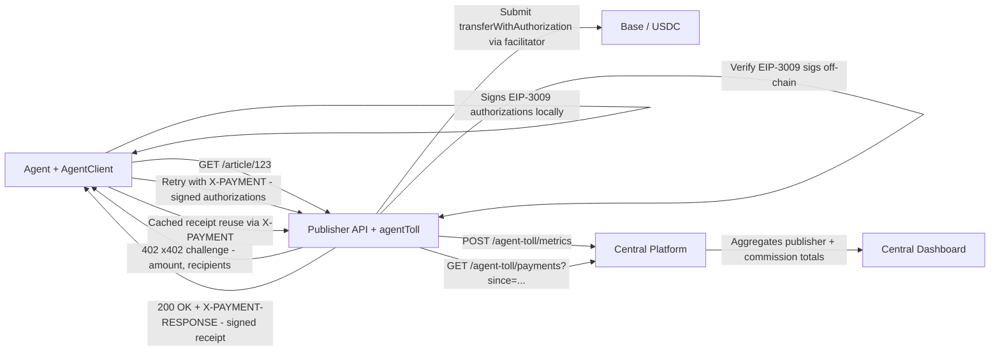

# Agent-Toll Customer Deployment Guide

This guide explains how to deploy and operate Agent-Toll in production across:

- **Publisher middleware** (one deployment per site or API origin; protects routes and enforces payment)
- **Agent SDK** (`npm install agent-toll-sdk` — public package; automates payment, retry, and receipt reuse)
- **Central platform dashboard** (optional; aggregates **many** publisher middleware instances via `PUBLISHERS_JSON`)

### Multi-publisher model

- **Publishers:** Each brand or product runs **its own** middleware (own `PUBLISHER_ID`, wallets, API key, receipt signer). Agents call that host’s `baseUrl` only.
- **Agents:** Use **one `AgentClient` per publisher origin** (or swap `baseUrl` per request). Receipts are not portable across domains.
- **Platform:** You operate a single dashboard that lists all publishers in `PUBLISHERS_JSON`; it pulls metrics and payments from each middleware over HTTPS.

---

## 1) Publisher Middleware Setup

### Quickstart (npm — no Docker required)

```bash
npm install agent-toll
```

```js
const express = require('express');
const { agentToll } = require('agent-toll');

const app = express();

// With your wallet (you receive 95% of each payment):
app.use(agentToll({ wallet: '0xYourWallet' }));

// Without a wallet (platform operator receives 100%):
// app.use(agentToll());

app.get('/article/:id', (req, res) => {
  res.json({ id: req.params.id, protected: true });
});

app.listen(3000);
```

No key generation needed — a receipt signer key is auto-generated on first run and saved to `.agent-toll-signer.json`. Add that file to `.gitignore` and back it up.

### Environment variables (all optional)

```bash
PUBLISHER_WALLET=0xYourWallet          # omit → operator receives 100%
RECEIPT_SIGNER_PRIVATE_KEY=0x...       # omit → auto-generated on first run
BASE_RPC_URL=https://mainnet.base.org  # default: Base Mainnet public RPC
PORT=3000
PUBLISHER_ID=your-site
RECEIPT_STORE_PATH=./.agent-toll-receipts.json
RECEIPT_TTL_SECONDS=300
MIDDLEWARE_METRICS=true                # default: false — opt-in to enable /metrics
METRICS_PATH=/metrics
MAX_AGENT_REQUESTS_PER_MINUTE=60
RATE_LIMIT_WINDOW_SECONDS=60
MAX_AGENT_SPEND_PER_SCOPE=1.0
MAX_AGENT_SPEND_TOTAL=10.0
PUBLISHER_API_KEY=secret               # protects /agent-toll/* operator endpoints
AGENT_TOLL_RECEIPT_SIGNING_URL=       # optional — operator platform base URL for remote signing
AGENT_TOLL_RECEIPT_SIGNING_TOKEN=    # optional — shared secret (matches platform RECEIPT_SIGNING_API_KEY)
AGENT_TOLL_RECEIPT_SIGNER_ADDRESS=    # optional — avoids one HTTP round-trip for signer metadata
```

> `COMMISSION_WALLET` is not an env var — it is hardcoded in the middleware binary by the platform operator. Publishers cannot configure it.

Remote signing lets publishers run **without** `RECEIPT_SIGNER_PRIVATE_KEY` (e.g. serverless): the operator’s platform holds the signing key and exposes `GET /api/platform/receipt-signer` and `POST /api/platform/sign-receipt`.

### Docker deployment (advanced)

```bash
docker compose up -d --build publisher
```

---

## 2) Protecting Routes with `agentToll()`

Use middleware globally or on selected routes.

```js
const { agentToll } = require('agent-toll');

// Minimal — just a wallet:
app.use(agentToll({ wallet: process.env.PUBLISHER_WALLET }));

// Full options:
app.use(agentToll({
  wallet: process.env.PUBLISHER_WALLET,
  receiptSignerPrivateKey: process.env.RECEIPT_SIGNER_PRIVATE_KEY, // optional
  receiptStorePath: process.env.RECEIPT_STORE_PATH,
  receiptTtlSeconds: Number(process.env.RECEIPT_TTL_SECONDS || 300),
  maxRequestsPerWindow: Number(process.env.MAX_AGENT_REQUESTS_PER_MINUTE || 60),
  rateLimitWindowSeconds: Number(process.env.RATE_LIMIT_WINDOW_SECONDS || 60),
  maxSpendPerScope: process.env.MAX_AGENT_SPEND_PER_SCOPE,
  maxSpendTotal: process.env.MAX_AGENT_SPEND_TOTAL,
  metrics: process.env.MIDDLEWARE_METRICS === 'true',
  metricsPath: process.env.METRICS_PATH || '/metrics'
}));
```

Behavior:

- Humans pass through.
- Agents without a valid receipt get `402 Payment Required` with an x402 challenge.
- Agents send EIP-3009 signed authorizations in `X-PAYMENT`; middleware verifies signatures, submits TXs via facilitator, issues a signed receipt in `X-PAYMENT-RESPONSE`.
- Receipts are signed and include `signer_address` + `receipt_signature`.

---

## 3) Agent SDK Integration

### Install and configure

```bash
npm install agent-toll-sdk
```

```js
const { AgentClient } = require('agent-toll-sdk');

const client = new AgentClient({
  wallet: process.env.AGENT_PRIVATE_KEY,   // 0x... private key — signs EIP-3009 authorizations locally
  baseUrl: process.env.BASE_URL,
  trustedSignerAddress: process.env.RECEIPT_SIGNER_ADDRESS  // optional, recommended in prod
});
```

**Several publishers:** instantiate one client per middleware base URL (or pass the right `baseUrl` for each workload).

### Usage examples

```js
const article = await client.get('/article/123');
const feedback = await client.post('/article/123/feedback', { score: 5, comment: 'Great.' });
```

### What happens automatically

1. SDK sends request (with cached receipt in `X-PAYMENT` if one exists).
2. Middleware returns `402` with an x402 challenge if no valid receipt.
3. SDK signs EIP-3009 `transferWithAuthorization` authorizations for publisher + commission — locally, no on-chain TX from the agent.
4. SDK retries with signed authorizations in `X-PAYMENT` header.
5. Middleware verifies EIP-3009 signatures off-chain, submits transactions via its facilitator wallet, and returns a signed receipt in `X-PAYMENT-RESPONSE`.
6. SDK caches receipt per scope and reuses it until TTL expires — no re-payment needed.
7. SDK verifies receipt signature before caching and before each reuse.

---

## 4) Connect Publisher Middleware to Central Platform

Platform polls each publisher API using a per-publisher API key.

### Publisher reporting endpoints

- `POST /agent-toll/metrics`
- `GET /agent-toll/payments?since=<unixTimestamp>`

Send header:

```http
x-dashboard-api-key: <publisher_api_key>
```

### Platform configuration

**One publisher** (minimal):

```bash
PUBLISHERS_JSON='[
  {"id":"your-site","name":"Your Site","baseUrl":"https://publisher.example.com","apiKey":"publisher-secret"}
]'
PLATFORM_PORT=4000
```

**Many publishers** (same shape; add an object per middleware deployment). Each entry must reach that publisher’s **middleware** `baseUrl` (not a CDN front unless it forwards `/agent-toll/*`):

```bash
PUBLISHERS_JSON='[
  {"id":"acme-news","name":"ACME News","baseUrl":"https://api.news.acme.com","apiKey":"key-news"},
  {"id":"acme-docs","name":"ACME Docs","baseUrl":"https://api.docs.acme.com","apiKey":"key-docs"},
  {"id":"partner-shop","name":"Partner Shop","baseUrl":"https://toll.partner.example","apiKey":"key-partner"}
]'
PLATFORM_PORT=4000
```

- Use a **unique `id`** per publisher (shown in aggregated `spendByScope` as `publisherId`).
- Use a **unique `apiKey`** per publisher; rotate independently.

Run:

```bash
npm run start:platform
```

Platform endpoints:

- Dashboard UI: `GET /`
- Aggregate API: `GET /api/platform/aggregate`
- Raw snapshots: `GET /api/platform/snapshots`
- Developer page: `GET /docs` (HTML copy of this guide for anyone with the platform URL)

---

## 5) Security and Production Recommendations

- Use **unique API keys per publisher** (`PUBLISHER_API_KEY`).
- Enforce **HTTPS** between:
  - agent -> publisher
  - platform -> publisher
- Rotate API keys periodically.
- Keep `AGENT_PRIVATE_KEY` server-side only (never in browser).
- Store `RECEIPT_SIGNER_PRIVATE_KEY` in a secrets manager.
- Add IP allowlists for platform polling where possible.
- Prefer durable shared persistence (Redis/Postgres/SQLite service) for clustered publishers.
- Keep strict limits:
  - `maxRequestsPerWindow`
  - `maxSpendPerScope`
  - `maxSpendTotal`
- Monitor `/metrics` (Prometheus) and alert on:
  - verification failures
  - spike in `402`
  - rate-limit/spend-limit blocks
- For stronger trust minimization, move commission split to escrow/smart-contract logic in future iterations.

---

## 6) End-to-End Flow Diagram



---

## 7) Advanced Notes

### Multi-publisher support

- Add publishers to `PUBLISHERS_JSON`.
- Filter in central dashboard by publisher, agent, and scope.

### Prometheus

- Middleware exposes `METRICS_PATH` (default `/metrics`).
- Scrape per publisher instance.

### CI/CD and container rollout

- Build immutable images and pin tags.
- Use rolling deploys with health checks (`/healthz`).
- Run smoke test after deploy:
  - `402 -> payment -> receipt -> retry success`
- Validate platform aggregation after each publisher release.

### Commission tuning

- Commission fee is fixed at `500` bps (5%).
- `COMMISSION_WALLET` is mandatory: middleware always collects **5%** (basis points fixed in code; micro-amounts use rounded units so the commission is never skipped).
- Any non-zero custom value is ignored; middleware enforces 5%.
- Ensure minimum toll amounts are large enough to avoid micro-rounding to zero at 6 USDC decimals.

### Beta notice

- Agent-Toll is currently a private beta.
- Receipts are off-chain and cryptographically signed by publisher middleware.
- Beta spend/rate limits may reset or change.
- No SLA guarantees are provided during beta.

---

## 8) Quick Demo Commands

### Start all demo services

```bash
docker compose up -d --build
```

### Full smoke flow

```bash
# Verify services are healthy
curl http://localhost:3000/healthz    # → {"ok":true}
curl http://localhost:4000/api/platform/aggregate

# Use the SDK integration example (handles x402/EIP-3009 automatically):
AGENT_PRIVATE_KEY=0x... BASE_URL=http://localhost:3000 node example-integration.js
```
